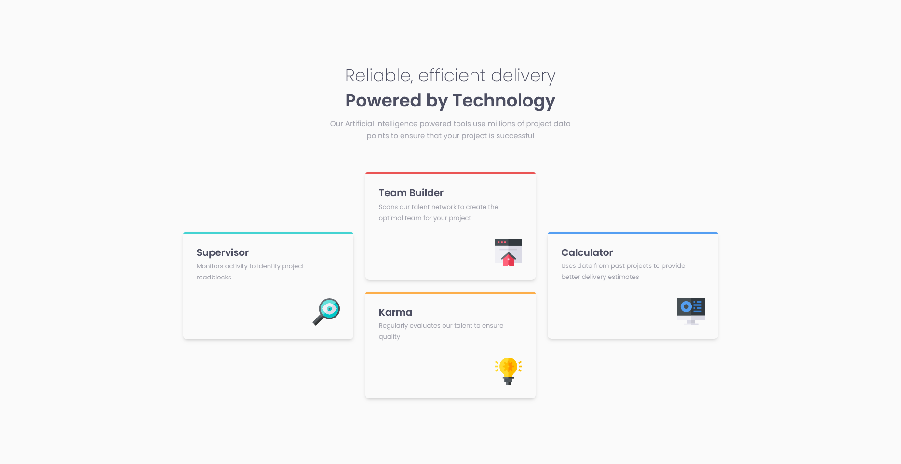

# Frontend Mentor - Four card feature section solution

This is a solution to the [Four card feature section challenge on Frontend Mentor](https://www.frontendmentor.io/challenges/four-card-feature-section-weK1eFYK). Frontend Mentor challenges help you improve your coding skills by building realistic projects.

## Table of contents

- [Overview](#overview)
  - [The challenge](#the-challenge)
  - [Screenshot](#screenshot)
  - [Links](#links)
- [My process](#my-process)
  - [Built with](#built-with)
  - [What I learned](#what-i-learned)
  - [Continued development](#continued-development)
  - [Useful resources](#useful-resources)
- [Author](#author)

## Overview

### The challenge

Users should be able to:

- View the optimal layout for the site depending on their device's screen size

### Screenshot

### Links

- Solution URL: [Frontend Mentor](https://www.frontendmentor.io/solutions/four-card-feature-section-using-tailwindcss-c6n2agKkDq)
- Live Site URL: [Vercel](https://jyln-four-card-feature-challenge.vercel.app/)

## My process

### Built with

- Semantic HTML5 markup
- Flexbox
- CSS Grid
- Mobile-first workflow
- [TailwindCSS][tailwinddocs]
- [Parcel](https://parceljs.org/docs) - for simple static site building

### What I learned

I never really use CSS Grid for layouts. Generally, I've been pretty happy with trying to negotiate flexbox for creating my layouts. This time I wanted to challenge myself to use grid and flexbox to create the layout from the design. Trying to center the outer card columns vertically was difficult but after I practiced grid by playing [Mastery Games - Grid Critters][gridcritters], I was able to transfer the knowledge to Tailwind utility classes and center the outer columns.

### Continued development

Building this project using both flexbox and grid was not nearly as difficult as I thought it would be. That may be the result of actually practicing grid before jumping into this challenge, but ultimately, I want to keep using the combination of flexbox and grid to build layouts because doing so will help keep my markup fairly clean.

### Useful resources

- [Tailwind CSS Docs][tailwinddocs]
- [Mastery Games - Grid Critters][gridcritters]

## Author

- Website - [JYLN](https://jyln.dev)
- Frontend Mentor - [@JYLN](https://www.frontendmentor.io/profile/JYLN)

[tailwinddocs]: https://tailwindcss.com/docs
[gridcritters]: https://mastery.games/gridcritters/
